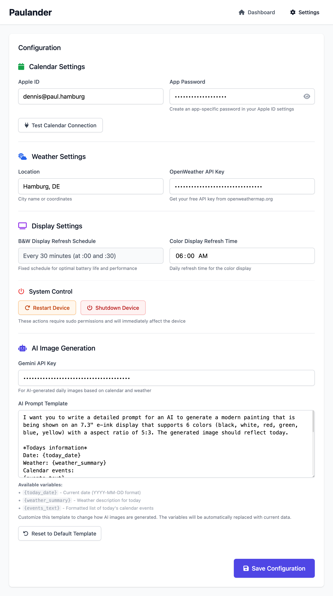

I needed a gift for my girlfriend and I wanted to make it myself.
This is the result. Shoutout to [Anke Dietzen](https://www.raspberry-pi-geek.de/ausgaben/rpg/2019/06/infoscreen-mit-e-ink-displays/) for the inspiration.
Thanks to [Lenny](https://www.instagram.com/lyo.riginal/) for helping me with the creative process.

---

The black and white display shows a weather forecast and upcoming calendar events.
The color display shows a daily AI-generated image based on the date, weather and calendar events of the day.


## Shopping List
| Name                                 | Price    | Amazon Link             |
|--------------------------------------|----------|-------------------------|
| ESP32 NodeMCU (unsoldered)           | 10.99 €  | https://amzn.to/4no5YZF |
| Raspberry Pi Power Supply            | 13.00 €  | https://amzn.to/4nqPOPk |
| Samsung PRO Endurance microSD 32GB   | 12.09 €  | https://amzn.to/4npeDeb |
| Raspberry Pi Zero 2 W                | 22.99 €  | https://amzn.to/3HRFMHV |
| Raspberry Pi Case                    | 10.99 €  | https://amzn.to/46gbJS6 |
| Wooden Foil                          | 6.59 €   | https://amzn.to/3JXo3PN |
| Moos Glue                            | 17.98 €  | https://amzn.to/46wEbk0 |
| Waveshare 7.3" 6-Color E-INK Display | 107.99 € | https://amzn.to/3IiN07R |
| Moss 500g                            | 20.99 €  | https://amzn.to/4gmp7sG |
| Waveshare 7.5" E-INK Display         | 69.99 €  | https://amzn.to/4gi6ohG |

In the first draft the shopping list was way cheaper, but the idea with a color display in combination with AI image generation didn't left me.

## Quick Start

### Wiring
Connect all the cables according to the [PINOUT.md](PINOUT.md) file.

### System Dependencies (Raspberry Pi)
First install the required system packages:
```bash
sudo apt-get update
sudo apt-get install python3-pip python3-pil python3-numpy
sudo pip install uv
sudo raspi-config nonint do_spi 0  # Enable SPI interface
sudo raspi-config nonint do_i2c 0  # Enable I2C interface
```

### Using uv (recommended)
```bash
# Initialize git submodules (required for Waveshare e-paper library)
git submodule update --init --recursive

# Install dependencies (including Raspberry Pi GPIO support)
uv sync --extra rpi

# Copy environment file and configure
cp .env.example .env
# Edit .env with your API keys

# Run the application
uv run python run.py
```

## Configuration

1. Open http://raspberrypi.local:5000/config in your browser
2. Configure your iCloud calendar credentials (required)
3. Set your OpenWeather API key (required)
4. Configure Gemini API key for AI-generated images (required)
   - Get your API key from [Google AI Studio](https://aistudio.google.com/app/apikey)

## Hardware Requirements

- Raspberry Pi Zero 2 WH
- Waveshare 7.3" color e-ink display (800x480)
- ESP32 NodeMCU CP2102 (for B&W display)
- Waveshare 7.5" black and white e-ink display (800x480)

## Features

- **Calendar Integration**: Connects to iCloud calendar via CalDAV
- **Weather Display**: Current weather and forecast from OpenWeatherMap
- **AI Image Generation**: Uses Gemini 2.5 Flash to create personalized vintage-style images based on weather and calendar events, optimized with high-performance vectorized Floyd-Steinberg dithering for e-ink displays
- **Dual Displays**: 
  - Color display: Daily AI-generated vintage poster refresh at 6 AM (800x480, 6 colors)
  - B&W display: Weather and calendar updates via ESP32 I2C communication (API cache: 30min, I2C send: 30sec)
- **Web Interface**: Mobile-first responsive configuration interface
- **Robust Operation**: Automatic restarts and error handling

## Production Deployment

For production use on Raspberry Pi, set `FLASK_ENV=production` in your `.env` file to disable debug mode and auto-reload, which can interfere with GPIO hardware initialization.
